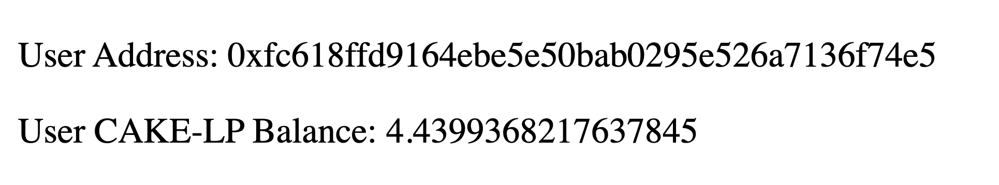

# KBTGxNL Defi Board

A demo version of getting CAKE-LP token balance by user address.

### Example result:


### To run
```bash
yarn
yarn start
```

### TODO
- [x] Add pending `CAKE` reward.
- [ ] Add `LP token` as `token0`, `token1`.
- [ ] Add user wallet token.
- [ ] Add price as `USD`.
